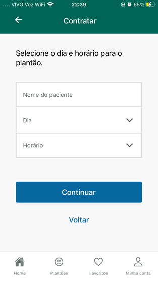

# Teste Prático UpBase

Teste pratico da UpBase

Recriar a tela de 'Contratar' do protótipo

Segue link para acessar o protótipo:

- [Protótipo Figma](https://www.figma.com/file/d2IXdKd2gy2yRzQC1ZNblB/Untitled?node-id=0%3A1)

### Desafio:

Imagine que ....
Você faz parte da nossa equipe de desenvolvedores front-end durante a
divisão de tarefas você foi designado para fazer uma tela, em React
native.

• A missão da equipe é criar uma página do zero, você como
desenvolvedor front-end ficou responsável por fazer uma tela do projeto.

### Screenshots:

# Tela Proposta

# Tela Realizada

### Stacks

- [Javascript](https://developer.mozilla.org/pt-BR/docs/Web/JavaScript)
- [react-native](https://reactnative.dev/)
- [expo](https://expo.dev/)
- [IonIcons](https://ionic.io/ionicons)
- [@react-navigation/bottom-tabs](https://reactnavigation.org/docs/bottom-tab-navigator/)

## Autor

- Linkedin - [Guilherme Vieira](https://www.linkedin.com/in/guilherme-vieira-silva/)
- GitHub - [Guilherme Vieira](https://github.com/Guivieirasilva)

